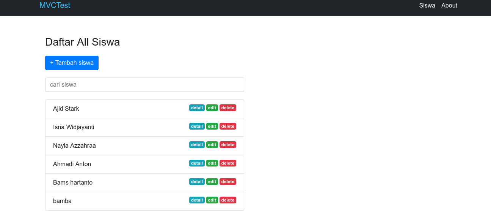
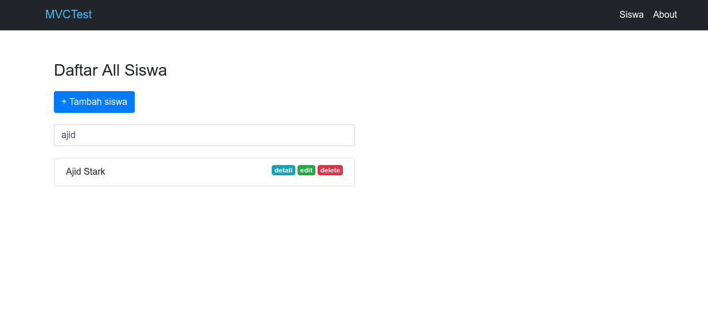
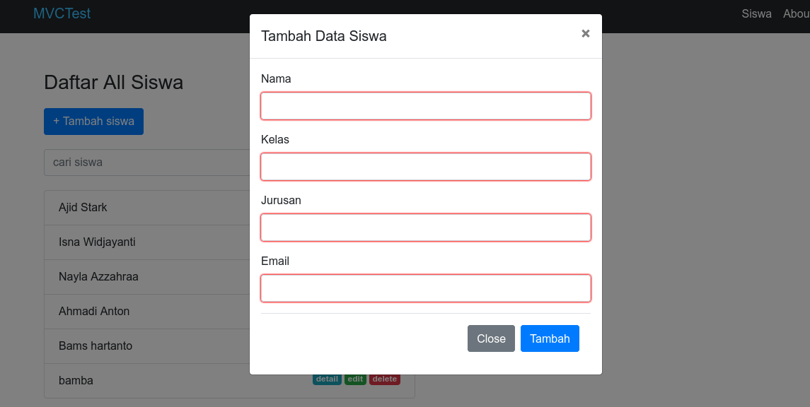
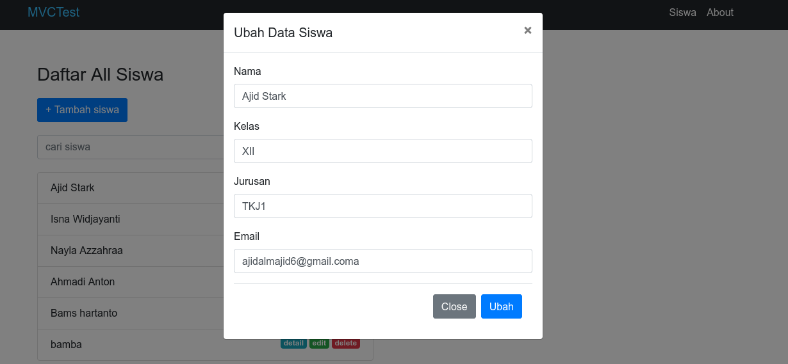

# Belajar MVC

Kegiatan yang saya lakukan waktu libur sekolah.

## screenshoot:

- Controller siswa

- Ajax search

- Tambah data

- Edit data

## Dibangun dengan:
- Backend : PHP 7.4
- Frontend : HTML, CSS, JavaScript
- Frontend Framework : Bootstrap, JQuery, Ajax
- Database : MySQL
- Database Driver : PDO

## Author:

- Fb : [AJID STARK](https://fb.me/ajidstark)
- Twitter : [@ajidstark](https://twitter.com/ajidstark)
- LinkedIn : [Yusuf Al Majid](https://www.linkedin.com/in/yusuf-al-majid/)

## Thanks to:

- Web Programming Unpas
- Refrensi belajar  : [Web Programming Unpas - Membuat Aplikasi MVC dengan PHP](https://www.youtube.com/playlist?list=PLFIM0718LjIVEh_d-h5wAjsdv2W4SAtkx)
